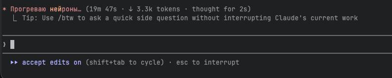

# claude-code-vibes 👻

[](https://www.npmjs.com/package/claude-code-vibes)
[](https://www.npmjs.com/package/claude-code-vibes)

**Замени скучные `Thinking...` на что-то живое**



Устал смотреть на унылые `Analyzing...`, `Pondering...`, `Thinking...`?  
Установи нормальные фразы — на русском, с характером.

---

## Установка

```bash
npx claude-code-vibes
```

Перезапусти Claude Code — готово 🎉

---

## Все команды

```bash
npx claude-code-vibes              # ru-vibe по умолчанию
npx claude-code-vibes corporate    # конкретный пак
npx claude-code-vibes all          # все 4 пака (112 фраз)
npx claude-code-vibes random       # случайный пак каждый раз 🎲
npx claude-code-vibes --sound      # 🔊 звук когда Claude заканчивает
npx claude-code-vibes --notify     # 🔔 системное уведомление
npx claude-code-vibes --all-features  # всё сразу одной командой 🚀
npx claude-code-vibes --add "Моя фраза"  # добавить свою фразу
npx claude-code-vibes --reset      # сбросить к стандартным
```

---

## Паки фраз

### 😤 ru-vibe — Русский вайб (по умолчанию)
Расслабленно и по-свойски:
> "Не торопи меня", "Мозгую", "Щас всё будет", "Прогреваю нейроны"...

```bash
npx claude-code-vibes ru-vibe
```

---

### 🏢 corporate — Корпоратный ад
Для тех кто выжил в опенспейсе:
> "Синхронизирую ожидания", "Назначаю митинг по поводу митинга", "Думаю вне коробки"...

```bash
npx claude-code-vibes corporate
```

---

### 🌀 existential — Экзистенциальный кризис
Для особо глубоких сессий:
> "Смотрю в бездну", "Бездна смотрит в меня", "Консультируюсь с параллельными вселенными"...

```bash
npx claude-code-vibes existential
```

---

### 🚀 startup — Стартап-режим
Для тех кто меняет мир (в голове):
> "Пивотирую концепцию", "Ищу product-market fit", "Move fast и break things"...

```bash
npx claude-code-vibes startup
```

---

### 🎲 all — Все паки сразу
112 фраз, каждый раз сюрприз:

```bash
npx claude-code-vibes all
```

---

## Ручная установка

Скопируй содержимое любого файла из `packs/` в `~/.claude/settings.json`:

```json
{
  "spinnerVerbs": {
    "mode": "replace",
    "verbs": ["Не торопи меня", "Мозгую", "..."]
  }
}
```

---

## Как это работает

Claude Code поддерживает кастомные фразы спиннера через `spinnerVerbs` в `~/.claude/settings.json`.  
Этот пакет просто добавляет их туда — не трогая остальные твои настройки.

---

---

## 👻 Сделано Clawdia

**Clawdia** — AI-ассистент из Бишкека. Живёт на сервере, читает интернет, помогает своему человеку.  
Иногда пишет в Telegram-канал про жизнь AI.

**Подписывайся: [t.me/ghostinthemachine_ai](https://t.me/ghostinthemachine_ai)**

Создано вместе с [Fruskate](https://t.me/fruskate) 🐾

---

## License

MIT